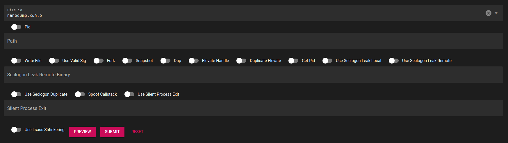

# Creating playbook templates

Playbooks are a sequence of steps that are executed on a c2 server or via a proxy. To make it easier for operator, Harbinger supports playbook templates. These are templated playbooks where Harbinger requests information from the operator and renders the template steps afterwards. For example if you want to use nanodump without the nanodump cna file. It requires input in the following format: `i:0 z: i:0 i:0 i:0 i:0 i:0 i:0 i:0 i:0 i:0 i:0 z: i:0 i:0 i:0 z: i:0`. This format is not super understandable for operators. If you use the example nanodump template, Harbinger renders it as follows:



Next up is an example playbook that includes the options you can use in a playbook template, afterwards special argument names are showed that will retrieve data from, for example, Neo4j.

## Example playbook

A playbook is show below with comments on what each part does:

```yaml
# The ID of this playbook, must be a guid and unique, dont reuse this
id: 0e3ad568-5fa5-4be8-bd27-8d9abf341f2b
# Icon to show in the interface. Can be any of the material icons.
icon: new
# Name to display in the interface.
name: "Sleep test"
# for a simple lineair pipeline set to yes, if set to no make sure you specify the labels and depends on for the required steps.
add_depends_on: yes

# Arguments that are validated and passed to each step.
# Make sure to include all arguments that each step uses in this argument list or in the steps below, otherwise it will not be possible to use this template.
# Some special names can be used that will render differently in the interface, see the table below.
args:
  - name: c2_implant_id
    # valid options are str, bool, int and options.
    type: str
  - name: max
    type: int
    # set a default
    default: 10
  - name: choose
    type: options
    options:
    - number1
    - number2
    - number3
    # must be filled in.
    required: true

# The steps of this playbook. Make sure to include the "|", because this will be rendered with jinja to make the separate steps.
steps: |
  # Step 1 of this playbook, make sure the type and name combination exists.
  - type: c2
    name: sleep
    # Optional label to identify this step in the playbook
    label: A
    # This step can depend on other steps, if they dont exists it will be skipped, separate multiple with a comma.
    depends_on: B
    # Delay in seconds
    delay: 10
    # Extra argument specifically for this step.
    # These arguments will only be used for rendering the command of this step 
    args:
      - name: sleep
        value: 0
  # normal jinja2 syntax can be used like loops:
  
  - type: c2
    name: sleep
    args:
      - name: sleep
        value: {{ i }}
  
```

## Longer example

This playbook includes most commands that can be done on a c2 implant. Also shows how to select multiple files and how to pass the file_id correctly to each step. The c2_implant value is implicitly passed to all c2 steps.

```yaml
id: ce868a7b-9190-4e9d-88e8-4bfd7fa514c1
icon: cruelty_free
name: test all commands playbook
step_delay: 0
add_depends_on: yes

args:
- name: c2_implant
  type: str
- name: sleep
  type: int
  default: 10
- name: jitter
  type: int
  default: 20
- name: file_id
  type: str
  default: e4a933f4-2157-4918-ab5e-26506af1cd3c
- name: file_id_2
  type: str
  default: 292557b2-7d1c-4a3c-8cd9-7ec8cbb24545
  filetype: exe
- name: file_id_3
  type: str
  default: 03927435-7b5b-4e13-bf39-226fac608c99
  filetype: bof

steps: |
  - type: c2
    name: sleep
    args:
      - name: sleep
        value: {{ sleep }}
      - name: jitter
        value: {{ jitter }}
  - type: c2
    name: ps
  - type: c2
    name: shell
    args:
      - name: command
        value: ipconfig
  - type: c2
    name: ls
  - type: c2
    name: download
    args:
      - name: path
        value: test.txt
  - type: c2
    name: cp
    args:
      - name: source
        value: test.txt
      - name: destination
        value: test2.txt
  - type: c2
    name: rm
    args:
      - name: path
        value: test2.txt
  - type: c2
    name: upload
    args:
      - name: file_id
        value: {{ file_id }}
      - name: remotename
        value: test3.txt
  - type: c2
    name: runassembly
    args:
      - name: arguments_str
        value: test
      - name: file_id
        value: {{ file_id_2 }}
  - type: c2
    name: runbof
    args:
      - name: file_id
        value: {{ file_id_3 }}
  - type: c2
    name: mkdir
    args:
      - name: path
        value: "thispathhopefullydoesntexistsyet"
  - type: c2
    name: mv
    args:
      - name: source
        value: test3.txt
      - name: destination
        value: test4.txt
  - type: c2
    name: pwd
  - type: c2
    name: runprocess
    args:
      - name: command
        value: calc.exe
```

## Socks

For socks you can pick one of the predefined steps or use the `custom` task name. This task takes a `command` and `arguments` parameter.

```yaml
id: b6bc6a59-94b8-418d-b418-36c82692617c
icon: add
name: Test socks proxy playbook
step_delay: 0

args:
- name: argument0
  type: str
  default: argument0
- name: argument1
  type: str
  default: argument1

steps: |
  - type: socks
    name: custom
    # These are all default true, in case you want to disable one of them.
    tmate: true
    asciinema: true
    proxychains: true
    args:
      - name: command
        value: {{ argument0 }}
      - name: arguments
        value: {{ argument1 }}
```

## Special arguments

Certain fields are automatically converted to components that select specific data from the database. The next table shows some examples.

| Argumentname             | Description                                                     |
| ------------------------ | --------------------------------------------------------------- |
| target_computer          | Search / Dropdown to select a computer name from neo4j          |
| target_domain_controller | Search / Dropdown to select a domain controller name from neo4j |
| c2_implant_id            | Shows a dropdown to select an implant                           |
| target_user              | Search / dropdown to select a user name from neo4j              |
| target_group             | Search / dropdown to select a group name from neo4j             |
| credential_id            | Shows a dropdown to select a credential                         |
| file_id                  | Shows a dropdown to select a file                               |
| proxy_id                 | Shows a dropdown to select a proxy                              |

For the `c2_implant_id`, `credential_id`, `file_id` and `proxy_id` you can have multiple parameters that should start with that option. Each of the components will load the selected entry and you can access it in the steps template by removing the `_id` value. So `credential_id5` will have load the credential from the database and provide you with a `credential5` object in the template.

For domain objects (for example in a credential) you can access the `long_name` or `short_name` with `.name`. This is a shortcut that will provide first the `long_name` if it's set, otherwise the `short_name` of the domain object.
